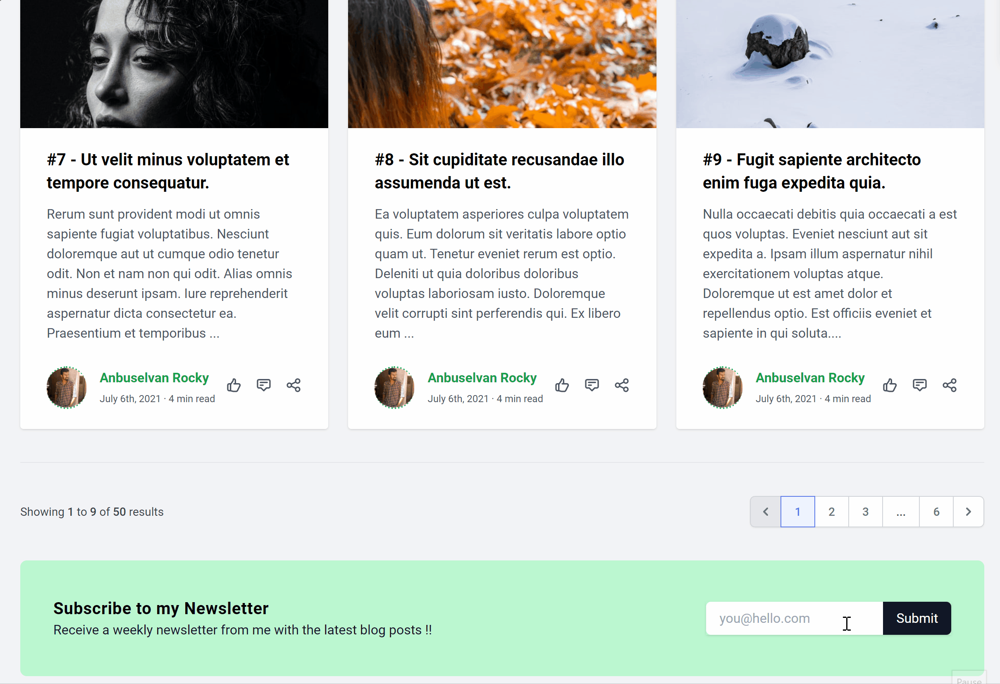

# Vue Tailwind Pagination

<a href="LICENSE">
  
</a>
<a href="https://github.com/anburocky3/vue-pagination-tw/issues">
  
</a>
<a href="https://npmjs.org/package/vue-pagination-tw">
  
</a>
<a href="https://www.npmjs.com/package/vue-pagination-tw">
  
</a>

[](https://nodei.co/npm/vue-pagination-tw/)

Simple Vue Pagination component that can be used in any project with range &amp; ui customization.

## Screenshots



[Online demo](https://stackblitz.com/edit/vue-y2ufn1) (Feel free to create your own.)

## Installation

### NPM

Install the npm package.

```js
$ npm install vue-pagination-tw --save
```

or yarn package

```js
$ yarn add -D vue-pagination-tw
```

### To Look good, Add the CSS files after initializing:

```js
import "vue-pagination-tw/styles"; // tailwind basic styles
```

Register the component.

- ES5

```js
var VuePaginationTw = require("vue-pagination-tw");
Vue.component("VuePaginationTw", VuePaginationTw);
```

- ES6

```js
import VuePaginationTw from "vue-pagination-tw";
Vue.component("VuePaginationTw", VuePaginationTw);
```

### CDN

Include the source file.

```html
<!-- use the latest release -->
<script src="https://unpkg.com/vue-pagination-tw@latest"></script>
<!-- or use the specify version -->
<script src="https://unpkg.com/vue-pagination-tw@0.9.0"></script>
```

Register the component.

```js
Vue.component("VuePaginationTw", VuePaginationTw);
```

## Usage

### In Vue Template

**Basic Usage**

```html
<VuePaginationTw
  :total-items="20"
  :current-page="1"
  :per-page="6"
  @page-changed="functionName"
  :go-button="false"
  styled="centered"
/>
```

_Note_: In vue template, camelCase and kebab-case are both supported. For example, you can either use prop `total-items` or `totalItems`. They are leading to the same result.

So this is also avaliable

```html
<VuePaginationTw
  :totalItems="20"
  :currentPage="1"
  :perPage="6"
  @pageChanged="functionName"
  :goButton="false"
  styled="centered"
/>
```

If you want to specify custom `Active Border color & text color`, you can do it like this:

```html
<VuePaginationTw
  :totalItems="20"
  :currentPage="1"
  :perPage="6"
  @pageChanged="functionName"
  :goButton="false"
  styled="centered"
  borderActiveColor="border-red-500"
  borderTextActiveColor="text-red-500"
/>
```

#### roadmaps

- [ ] Make different versions of paginations (xs, md, lg, xlg)
- [ ] Change Pagination ui templates directly from initialization.
- [ ] Support for make different ui styles by default.

#### Authors:

- Anbuselvan Rocky ([Facebook](https://fb.me/anburocky3))

#### License: [MIT](./LICENSE.md)
